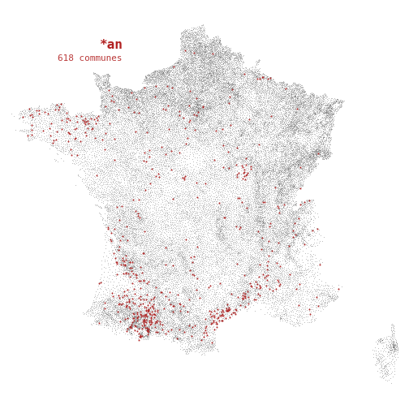
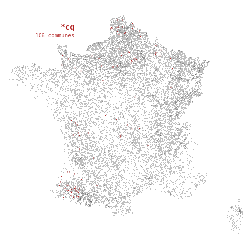
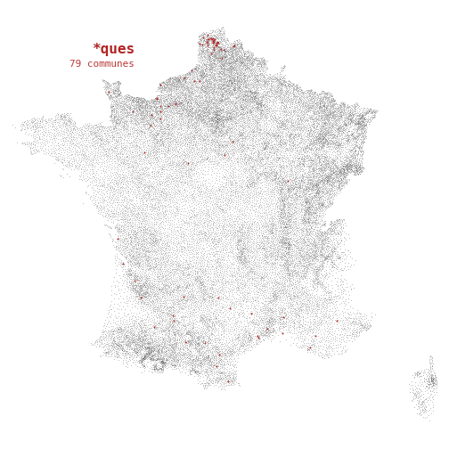

### *a  
 
### *ac  
 
### *iac  
 
### *illac  
 
### *ignac  
 
### *ssac  
 
### *ec  
 
### *and  
 
### *ard  
 
### *aud  
 
### *e  
 
### *ance  
 
### *age  
 
### *ange  
 
### *che  
 
### *the  
 
### *elle  
 
### *eille  
 
### *uille  
 
### *ville  
 
### *eville  
 
### *ainville  
 
### *onville  
 
### *erville  
 
### *sle  
 
### *ene  
 
### *agne  
 
### *igne  
 
### *fontaine  
 
### *-sur-seine  
 
### *anne  
 
### *enne  
 
### *onne  
 
### *iere  
 
### *aire  
 
### *-sur-loire  
 
### *erre  
 
### *ise  
 
### *sse  
 
### *euse  
 
### *ette  
 
### *gue  
 
### *que  
 
### *aye  
 
### *eze  
 
### *ize  
 
### *euf  
 
### *ing  
 
### *bourg  
 
### *ch  
 
### *bach  
 
### *i  
 
### *al  
 
### *val  
 
### *el  
 
### *il  
 
### *eil  
 
### *euil  
 
### *ol  
 
### *heim  
 
### *enheim  
 
### *an  
 
### *en  
 
### *in  
 
### *martin  
 
### *on  
 
### *illon  
 
### *un  
 
### *o  
 
### *cq  
 
### *er  
 
### *ier  
 
### *iller  
 
### *willer  
 
### *-sur-mer  
 
### *ur  
 
### *our  
 
### *as  
 
### *es  
 
### *anges  
 
### *ches  
 
### *elles  
 
### *illes  
 
### *ignes  
 
### *ines  
 
### *ennes  
 
### *ieres  
 
### *gues  
 
### *ques  
 
### *ais  
 
### *ois  
 
### *-bois  
 
### *es-bois  
 
### *ols  
 
### *ans  
 
### *ens  
 
### *ins  
 
### *-les-bains  
 
### *ons  
 
### *os  
 
### *mps  
 
### *ars  
 
### *ers  
 
### *iers  
 
### *villiers  
 
### *illers  
 
### *villers  
 
### *urs  
 
### *ts  
 
### *ets  
 
### *us  
 
### *at  
 
### *et  
 
### *ult  
 
### *ault  
 
### *ant  
 
### *ent  
 
### *ement  
 
### *mont  
 
### *aumont  
 
### *ot  
 
### *ert  
 
### *bert  
 
### *ort  
 
### *fort  
 
### *court  
 
### *ecourt  
 
### *icourt  
 
### *ancourt  
 
### *incourt  
 
### *oncourt  
 
### *aut  
 
### *eau  
 
### *ieu  
 
### *ou  
 
### *ix  
 
### *eix  
 
### *ux  
 
### *aux  
 
### *eaux  
 
### *eux  
 
### *oux  
 
### *y  
 
### *lay  
 
### *enay  
 
### *ray  
 
### *rey  
 
### *illy  
 
### *gny  
 
### *igny  
 
### *ery  
 
### *ssy  
 
### *ez  
 